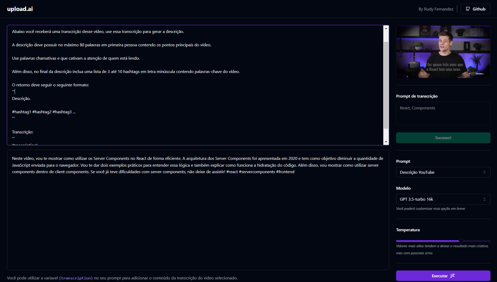

<h1 align="center">Upload ai</h1>

<p align="center">
Aplicação desenvolvida durante o evento Next Level Week AI <br/>
</p>

<p align="center">
  <a href="#-tecnologias">Tecnologias</a>&nbsp;&nbsp;&nbsp;|&nbsp;&nbsp;&nbsp;
  <a href="#-projeto">Projeto</a>&nbsp;&nbsp;&nbsp;|&nbsp;&nbsp;&nbsp;
  <a href="#-instalação">Instalação</a>&nbsp;&nbsp;&nbsp;|&nbsp;&nbsp;&nbsp;
  <a href="#-licença">Licença</a>
</p>

<p align="center">
  
  
  
</p>

<br>

<p align="center">
  
</p>

## 💻 Projeto

<strong>Upload.ai</strong> é uma plataforma inovadora que permite aos usuários enviar vídeos para a geração automática de títulos e descrições de videos criativas. Utilizando a inteligência artificial (IA) por meio da API do Chat GPT, a plataforma oferece uma maneira eficaz e conveniente de aprimorar a qualidade e o apelo dos vídeos, tornando-os mais atrativos para o público-alvo.

## 🚀 Tecnologias

Esse projeto foi desenvolvido com as seguintes tecnologias:

### Web
- [React](https://react.dev/)
- [TypeScript](https://www.typescriptlang.org/)
- [Vite js](https://vitejs.dev/)
- [Radix ui](https://www.radix-ui.com/)
- [Vercel AI SDK](https://www.npmjs.com/package/ai)
- [Axios](https://axios-http.com/)
- [Lucide React](https://lucide.dev/)
- [Tailwind CSS](https://tailwindcss.com/)
- [Shadcn/UI](https://ui.shadcn.com/)
- [ffmpeg.wasm](https://ffmpegwasm.netlify.app/)

### Server
- [Node js](https://nodejs.org/en)
- [TypeScript](https://www.typescriptlang.org/)
- [Fastify](https://fastify.dev/)
- [Prisma](https://www.prisma.io/)
- [Vercel AI SDK](https://www.npmjs.com/package/ai)
- [Postgre SQL](https://www.postgresql.org/)
- [Zod](https://zod.dev/)

## Instalação

### Clonagem

```bash
git clone https://github.com/rudyfernandes/nlw-ai-mastery.git
```

### Web

#### Instalação das dependências:
```bash
cd upload-ai-web
```

```bash
pnpm install
```

#### Start:

```bash
pnpm run dev
```

#### Acesse http://localhost:5173/


## Server

#### Instalação das dependências:

```bash
cd upload-ai-api
```

```bash
pnpm install
```

#### Variáveis de ambiente, adicione sua key API da OpenAI

```bash
DATABASE_URL="file:./dev.db"

OPENAI_KEY=""
```

#### Para criar as tabelas no Prisma

```bash
pnpm prisma generate
```

```bash
pnpm prisma migrate dev
```

#### Start:

```bash
pnpm run dev
```

## 📝 Licença

Esse projeto está sob a licença MIT. Veja o arquivo [LICENSE](LICENSE) para mais detalhes.
